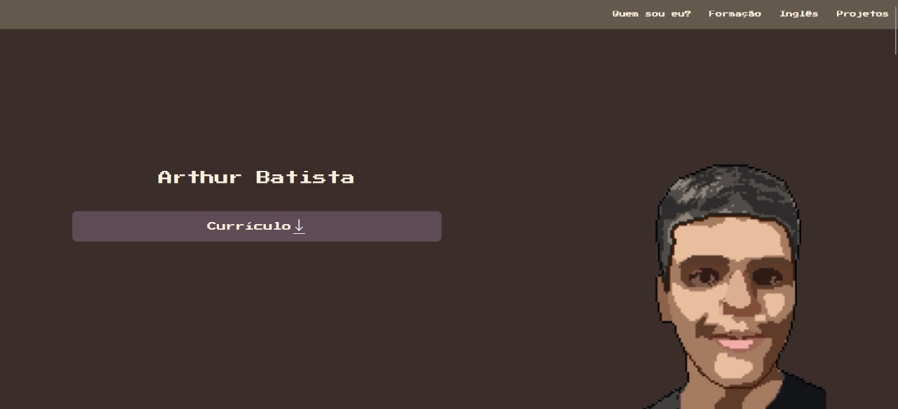

# Portfólio de Arthur Batista
### Criado para dizer um pouco sobre mim, as minhas competências e projetos que faço durante os meus estudos/trabalhos.

### Desenvolvido com as seguintes tecnologias:

### Acesse o portfólio [Aqui](https://arthur-batista.github.io/portfolio)
